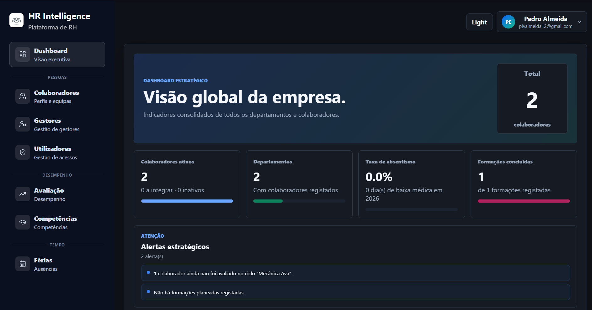

# HR Intelligence

Plataforma fullstack de gestão de Recursos Humanos desenvolvida como projeto final de licenciatura (UBI, 2025/2026).

## Screenshot


> Para visualizar a aplicação localmente, siga as instruções de setup abaixo.

## Tecnologias

| Camada | Stack |
|---|---|
| Frontend | React + Vite + Recharts |
| Backend | Node.js + Express (ESM) |
| Base de dados | MongoDB + Mongoose |
| Autenticação | JWT (7 dias) |

## Módulos implementados

### 4.1 - Gestão de Colaboradores e Gestores
- Perfis completos: cargo, departamento, equipa, contrato, histórico profissional, competências e certificações
- Pesquisa por nome, cargo e departamento
- Ativação/desativação de contas
- Integração de novos colaboradores com aprovação pelo gestor

### 4.2 - Gestão de Competências e Formações
- Matriz de competências por colaborador (níveis: iniciante, intermédio, avançado, especialista)
- Catálogo de formações com inscrição e acompanhamento de progresso
- Visão por departamento e análise de gaps

### 4.3 - Avaliação de Desempenho
- Ciclos de avaliação globais (criados pelo administrador) e de departamento (criados pelo gestor)
- Métricas personalizáveis por ciclo
- Avaliação da equipa pelo gestor com pontuação 1–5 por métrica
- Histórico de avaliações com nota final calculada automaticamente
- Comparativo visual da equipa por ciclo (gráfico de barras horizontal com cores por desempenho)

### 4.4 - Gestão de Férias e Ausências
- Pedidos de ausência pelo colaborador (férias, baixa médica, outro)
- Aprovação/rejeição pelo gestor com motivo
- Aprovação de pedidos de gestores pelo administrador
- Calendário global de ausências aprovadas
- Períodos bloqueados definidos pelo administrador
- Saldo de dias de férias por colaborador
- Taxa de absentismo no dashboard

### 4.5 - Dashboard Estratégico
- **Administrador**: distribuição por departamento, avaliações por ciclo, competências por nível, ausências por tipo, top competências, alertas estratégicos, taxa de absentismo
- **Gestor**: métricas da equipa, ausentes hoje, histórico de avaliações em radar, ciclo ativo
- **Colaborador**: saldo de férias, evolução de avaliações, radar de métricas da última avaliação

## Perfis e permissões

| Papel | Permissões principais |
|---|---|
| `colaborador` | Dashboard próprio, submeter pedidos de ausência, ver as suas avaliações e formações |
| `gestor` | Gerir equipa, criar ciclos de departamento, avaliar colaboradores, aprovar ausências |
| `administrador` | Acesso total: utilizadores, ciclos globais, todas as avaliações e ausências, dashboards |

## Setup

### Pré-requisitos
- Node.js 20+
- MongoDB Atlas (ou local)

### Backend

```bash
cd backend
npm install
```

Cria um ficheiro `.env` com:

```
MONGO_URI=mongodb+srv://...
JWT_SECRET=uma_string_secreta_longa
EMAIL_USER=...
EMAIL_PASS=...
```

```bash
npm run dev
```

API disponível em `http://localhost:5000`.

### Frontend

```bash
cd frontend
npm install
npm run dev
```

App disponível em `http://localhost:5173`.

## Estrutura do projeto

```
HR_Intelligence/
├── backend/
│   ├── src/
│   │   ├── models/         # Employee, User, Evaluation, EvaluationCycle, Leave, Training, ...
│   │   ├── routes/         # auth, employees, evaluations, leaves, training, users
│   │   ├── middleware/     # auth.js (requireAuth, requireRole)
│   │   ├── services/       # email
│   │   └── server.js
│   └── package.json
└── frontend/
    ├── src/
    │   ├── pages/          # Dashboard, Colaboradores, Gestores, Avaliação, Competências, Férias
    │   ├── components/     # AppLayout, AuthShell, EmptyState
    │   └── api.js          # Todas as chamadas à API
    └── package.json
```

## Autor

**Rodrigo Almeida** — nº 51597  
Licenciatura em Engenharia Informática · UBI 2025/2026
